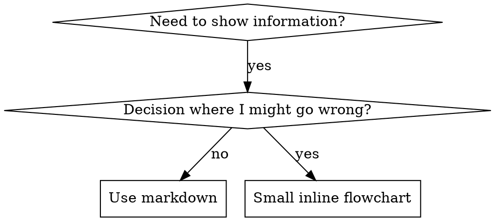

# Skill Authoring

## Overview

**Skill authoring is evidence-driven: prove the gap, then prove the skill closes it.**

A skill — new or edited — is justified by **evidence of a real gap first, and a differential eval after.** The gap is the empirical baseline: an agent that fails the task *without* the skill, a recorded misalignment (an `agent-updates` entry), a repeated gate failure, or a cluster of memories showing agents keep re-deriving the same thing unaided. You then draft the skill and measure the **difference** it makes — `with_skill` vs `without_skill` (or `old_skill`) — and keep it only if it measurably helps.

**Core principle:** Never add skill content for a gap you can't point to, and never claim a skill helps without a differential that shows it. Evidence bookends the work — it does not have to come *before* you write a single word.

> **Doctrine note (2026-06-06):** This replaces the old "**NO SKILL WITHOUT A FAILING TEST FIRST**" Iron Law. Pre-emptively pressure-testing a subagent *before* writing blocked machine-assisted skill generation (you can't run a baseline before a skill exists when you're synthesizing it from accumulated workflows) and is out of step with Anthropic's official `skill-creator`, where **tests come after the draft**. We keep the discipline (evidence + measured improvement) and drop the ordering that made it un-automatable. Full rationale: the ADR in `docs/.output/reviews/2026-06-06-adr-self-improving-skills.md`.

**REQUIRED OPERATIONAL SKILL:** For the actual create→eval→improve→benchmark loop, the eval harness, the differential workspace layout, and description optimization, use **`skill-creator`**. This skill (`skill-authoring`) owns the *doctrine and conventions*; `skill-creator` owns the *mechanics*. The autonomous driver that mines this repo's signals into skill work is `/review:evolve-skills`.

**Official guidance:** For Anthropic's official skill authoring best practices, see anthropic-best-practices.md.

## What is a Skill?

A **skill** is a reference guide for proven techniques, patterns, or tools. Skills help future Claude instances find and apply effective approaches.

**Skills are:** Reusable techniques, patterns, tools, reference guides

**Skills are NOT:** Narratives about how you solved a problem once

## TDD Mapping for Skills

| TDD Concept | Skill Creation |
|-------------|----------------|
| **Test case** | Pressure scenario with subagent |
| **Production code** | Skill document (SKILL.md) |
| **Test fails (RED)** | Agent violates rule without skill (baseline) |
| **Test passes (GREEN)** | Agent complies with skill present |
| **Refactor** | Close loopholes while maintaining compliance |
| **Establish baseline** | Capture the failure WITHOUT the skill — a run, a recorded `agent-updates` misalignment, or a memory cluster (capturing it *after* the draft is fine) |
| **Watch it fail** | Document exact rationalizations / the gap the agent shows |
| **Minimal code** | Write skill addressing those specific violations |
| **Watch it pass** | Verify the differential: `with_skill` beats baseline |
| **Refactor cycle** | Find new rationalizations → plug → re-verify |

The cycle keeps TDD's spirit, with one change: the baseline + eval **bookend** the draft rather than strictly preceding it (see The Law below). Mechanics: `skill-creator`.

## When to Create a Skill

**Create when:**
- Technique wasn't intuitively obvious to you
- You'd reference this again across projects
- Pattern applies broadly (not project-specific)
- Others would benefit

**Don't create for:**
- One-off solutions
- Standard practices well-documented elsewhere
- Project-specific conventions (put in CLAUDE.md)
- Mechanical constraints (if it's enforceable with regex/validation, automate it—save documentation for judgment calls)

## Skill Types

### Technique
Concrete method with steps to follow (condition-based-waiting, root-cause-tracing)

### Pattern
Way of thinking about problems (flatten-with-flags, test-invariants)

### Reference
API docs, syntax guides, tool documentation (office docs)

## Directory Structure


```
skills/
  skill-name/
    SKILL.md              # Main reference (required)
    supporting-file.*     # Only if needed
```

**Flat namespace** - all skills in one searchable namespace

**Separate files for:**
1. **Heavy reference** (100+ lines) - API docs, comprehensive syntax
2. **Reusable tools** - Scripts, utilities, templates

**Keep inline:**
- Principles and concepts
- Code patterns (< 50 lines)
- Everything else

## SKILL.md Structure

**Frontmatter (YAML):** Five required fields — the canonical contract is documented immediately below.
- `name`: Use letters, numbers, and hyphens only (no parentheses, special chars)
- `description`: Third-person. MAY lead with a brief *what it does* clause, but MUST state *when to use* it — the Agent Skills open spec allows both (≤ 1024 characters).
  - Keep the "Use WHEN..." triggering conditions — required even when a what-clause is present
  - Include specific symptoms, situations, and contexts
  - **NEVER summarize the skill's step-by-step process or workflow** — naming *what it covers* is fine; describing *how it works* lets Claude shortcut and skip the body (see CSO section for why)
  - Keep under 500 characters if possible (open-spec hard ceiling: 1024)
- `metadata`: `version`, `author`, `tags`
- `user-invocable`: Always `false` unless the skill is a slash command (rare)
- `allowed-tools`: Whitelist matching the skill's actual write surface

```markdown
---
name: skill-name-with-hyphens
description: "[Brief what-it-does clause — optional]. Use WHEN [specific triggering conditions and symptoms]. Triggers: keyword1, keyword2"
metadata:
  version: 1.0.0
  author: Domdhi.Agents
  tags: [tag1, tag2]
user-invocable: false
allowed-tools: Read Write Edit Grep Glob
---

# Skill Name

## Overview
What is this? Core principle in 1-2 sentences.

## When to Use
[Small inline flowchart IF decision non-obvious]

Bullet list with SYMPTOMS and use cases
When NOT to use

## Core Pattern (for techniques/patterns)
Before/after code comparison

## Quick Reference
Table or bullets for scanning common operations

## Implementation
Inline code for simple patterns
Link to file for heavy reference or reusable tools

## Common Mistakes
What goes wrong + fixes

## Real-World Impact (optional)
Concrete results
```


## Claude Search Optimization (CSO)

**Critical for discovery:** Future Claude needs to FIND your skill

### 1. Rich Description Field

**Purpose:** Claude reads description to decide which skills to load for a given task. Make it answer: "Should I read this skill right now?"

**Format:** Start with "Use when..." to focus on triggering conditions

**CRITICAL: Description = When to Use, NOT What the Skill Does**

The description should ONLY describe triggering conditions. Do NOT summarize the skill's process or workflow in the description.

**Why this matters:** Testing revealed that when a description summarizes the skill's workflow, Claude may follow the description instead of reading the full skill content. A description saying "code review between tasks" caused Claude to do ONE review, even though the skill's flowchart clearly showed TWO reviews (spec compliance then code quality).

When the description was changed to just "Use when executing implementation plans with independent tasks" (no workflow summary), Claude correctly read the flowchart and followed the two-stage review process.

**The trap:** Descriptions that summarize workflow create a shortcut Claude will take. The skill body becomes documentation Claude skips.

```yaml
# ❌ BAD: Summarizes workflow - Claude may follow this instead of reading skill
description: Use when executing plans - dispatches subagent per task with code review between tasks

# ❌ BAD: Too much process detail
description: Use for TDD - write test first, watch it fail, write minimal code, refactor

# ✅ GOOD: Just triggering conditions, no workflow summary
description: Use when executing implementation plans with independent tasks in the current session

# ✅ GOOD: Triggering conditions only
description: Use when implementing any feature or bugfix, before writing implementation code
```

**Content:**
- Use concrete triggers, symptoms, and situations that signal this skill applies
- Describe the *problem* (race conditions, inconsistent behavior) not *language-specific symptoms* (setTimeout, sleep)
- Keep triggers technology-agnostic unless the skill itself is technology-specific
- If skill is technology-specific, make that explicit in the trigger
- Write in third person (injected into system prompt)
- **NEVER summarize the skill's process or workflow**

```yaml
# ❌ BAD: Too abstract, vague, doesn't include when to use
description: For async testing

# ❌ BAD: First person
description: I can help you with async tests when they're flaky

# ❌ BAD: Mentions technology but skill isn't specific to it
description: Use when tests use setTimeout/sleep and are flaky

# ✅ GOOD: Starts with "Use when", describes problem, no workflow
description: Use when tests have race conditions, timing dependencies, or pass/fail inconsistently

# ✅ GOOD: Technology-specific skill with explicit trigger
description: Use when using React Router and handling authentication redirects
```

### 2. Keyword Coverage

Use words Claude would search for:
- Error messages: "Hook timed out", "ENOTEMPTY", "race condition"
- Symptoms: "flaky", "hanging", "zombie", "pollution"
- Synonyms: "timeout/hang/freeze", "cleanup/teardown/afterEach"
- Tools: Actual commands, library names, file types

### 3. Descriptive Naming

**Use active voice, verb-first:**
- ✅ `creating-skills` not `skill-creation`
- ✅ `condition-based-waiting` not `async-test-helpers`

### 4. Token Efficiency (Critical)

**Problem:** getting-started and frequently-referenced skills load into EVERY conversation. Every token counts.

**Target word counts:**
- getting-started workflows: <150 words each
- Frequently-loaded skills: <200 words total
- Other skills: <500 words (still be concise)

**Techniques:**

**Move details to tool help:**
```bash
# ❌ BAD: Document all flags in SKILL.md
search-conversations supports --text, --both, --after DATE, --before DATE, --limit N

# ✅ GOOD: Reference --help
search-conversations supports multiple modes and filters. Run --help for details.
```

**Use cross-references:**
```markdown
# ❌ BAD: Repeat workflow details
When searching, dispatch subagent with template...
[20 lines of repeated instructions]

# ✅ GOOD: Reference other skill
Always use subagents (50-100x context savings). REQUIRED: Use [other-skill-name] for workflow.
```

**Compress examples:**
```markdown
# ❌ BAD: Verbose example (42 words)
your human partner: "How did we handle authentication errors in React Router before?"
You: I'll search past conversations for React Router authentication patterns.
[Dispatch subagent with search query: "React Router authentication error handling 401"]

# ✅ GOOD: Minimal example (20 words)
Partner: "How did we handle auth errors in React Router?"
You: Searching...
[Dispatch subagent → synthesis]
```

**Eliminate redundancy:**
- Don't repeat what's in cross-referenced skills
- Don't explain what's obvious from command
- Don't include multiple examples of same pattern

**Verification:**
```bash
wc -w skills/path/SKILL.md
# getting-started workflows: aim for <150 each
# Other frequently-loaded: aim for <200 total
```

**Name by what you DO or core insight:**
- ✅ `condition-based-waiting` > `async-test-helpers`
- ✅ `using-skills` not `command-usage`
- ✅ `flatten-with-flags` > `data-structure-refactoring`
- ✅ `root-cause-tracing` > `debugging-techniques`

**Gerunds (-ing) work well for processes:**
- `creating-skills`, `testing-skills`, `debugging-with-logs`
- Active, describes the action you're taking

### 4. Cross-Referencing Other Skills

**When writing documentation that references other skills:**

Use skill name only, with explicit requirement markers:
- ✅ Good: `**REQUIRED SUB-SKILL:** systematic-debugging` (local skill name, no namespace prefix)
- ✅ Good: `**REQUIRED BACKGROUND:** verification-before-completion`
- ❌ Bad: `See skills/testing/test-driven-development` (unclear if required)
- ❌ Bad: `@skills/testing/test-driven-development/SKILL.md` (force-loads, burns context)
- ❌ Bad: `superpowers:test-driven-development` (`superpowers:*` is from an external library, not this repo)

**Why no @ links:** `@` syntax force-loads files immediately, consuming 200k+ context before you need them.

## Flowchart Usage



**Use flowcharts ONLY for:**
- Non-obvious decision points
- Process loops where you might stop too early
- "When to use A vs B" decisions

**Never use flowcharts for:**
- Reference material → Tables, lists
- Code examples → Markdown blocks
- Linear instructions → Numbered lists
- Labels without semantic meaning (step1, helper2)

See `.claude/skills/skill-authoring/graphviz-conventions.dot` for graphviz style rules.

**Visualizing for your human partner:** Use `render-graphs.js` in this directory to render a skill's flowcharts to SVG:
```bash
./render-graphs.js ../some-skill           # Each diagram separately
./render-graphs.js ../some-skill --combine # All diagrams in one SVG
```

## Code Examples

**One excellent example beats many mediocre ones**

Choose most relevant language:
- Testing techniques → TypeScript/JavaScript
- System debugging → Shell/Python
- Data processing → Python

**Good example:**
- Complete and runnable
- Well-commented explaining WHY
- From real scenario
- Shows pattern clearly
- Ready to adapt (not generic template)

**Don't:**
- Implement in 5+ languages
- Create fill-in-the-blank templates
- Write contrived examples

You're good at porting - one great example is enough.

## File Organization

### Self-Contained Skill
```
defense-in-depth/
  SKILL.md    # Everything inline
```
When: All content fits, no heavy reference needed

### Skill with Reusable Tool
```
condition-based-waiting/
  SKILL.md    # Overview + patterns
  example.ts  # Working helpers to adapt
```
When: Tool is reusable code, not just narrative

### Skill with Heavy Reference
```
pptx/
  SKILL.md       # Overview + workflows
  pptxgenjs.md   # 600 lines API reference
  ooxml.md       # 500 lines XML structure
  scripts/       # Executable tools
```
When: Reference material too large for inline

## Toolkit Skill Archetypes & Wiring

A skill in this toolkit is one of two shapes, and the `Overview / When to Use / Core Pattern` skeleton above is only one of them:

- **Doc-producer** — owns a `docs/_project-*.md` template in `assets/` (wired into `scaffold.js`'s `SKILL_TEMPLATE_MANIFEST`) and validates the artifact it produces. Use a `Document Template (one-line pointer to assets/) / Required Sections Checklist / Quality Criteria / Interview Questions` skeleton. The `assets/` copy is the **scaffold source of record** — raw, with the `<!-- @@template -->` first line — so the skill and `scaffold.js` share one copy.
- **Technique / prose** — encodes a method or voice, owns no scaffolded template. Use the `Overview / When to Use / Core Pattern` skeleton above. Examples: this skill, `systematic-debugging`, the design-technique skills (`design-taste-frontend`, `tailwind-css-patterns`), `ghostwriting`.

When in doubt, ask "does this skill own a scaffolded `_project-*.md` template?" Yes → doc-producer; No → technique/prose.

**Where the planning-pipeline doc-producers live:** the planning *text* documents are consolidated into **one** skill, **`project-planning`** (brief, requirements, feature-ideas, epics/stories backlog, and the project-context quick-ref — each its own `references/` guide + `assets/` template). It is NOT one skill per document and there is NO `-writer` suffix convention. The genuine design disciplines — **`architecture`** and **`ux-design`** — stay self-contained (each owns its own template *and* its craft knowledge), because they carry real domain judgment beyond producing a doc.

**Wiring checklist (new skill):**
- [ ] Directory at `.claude/skills/{name}/SKILL.md`, `name:` field matches the directory
- [ ] At least one agent lists it in frontmatter `skills:` — OR it's loaded directly by a command via `Read` (both valid)
- [ ] Content is domain knowledge, not orchestration (orchestration belongs in commands)
- [ ] No duplication of content already in another skill
- [ ] `description` leads with what-it-does + keeps the "Use WHEN…" triggering clause (CSO) — never a workflow summary
- [ ] If a doc-producer: template lives in `assets/` (raw, marker on line 1) and is registered in `SKILL_TEMPLATE_MANIFEST`

## The Law (evidence bookends the work)

```
NO SKILL CONTENT WITHOUT EVIDENCE OF A GAP — AND A DIFFERENTIAL THAT SHOWS IT CLOSES
```

This applies to NEW skills AND EDITS to existing skills. The order is **evidence → draft → differential eval**, not "test first."

- **Evidence of a gap (the baseline):** a `without_skill` / `old_skill` run that fails, an `agent-updates` misalignment, a repeated gate failure, or a cluster of memories showing agents keep re-deriving this unaided. No gap you can point to → no skill content. Speculative "this could be clearer" polish is out of scope.
- **Differential (the proof):** `with_skill` measurably beats the baseline on pass-rate — `node .claude/core/skill-eval.js aggregate <iteration> --skill-name <name>`. A delta ≤ 0 means the change isn't earning its place; iterate or drop it.

**The evidence requirement has no exceptions, but it can be lightweight:**
- "Simple addition" / "just a section" / "doc update" still needs a gap behind it — but the gap can be one recorded misalignment and the differential a single with/without spot-check.
- Subjective skills (writing style, design taste) are judged qualitatively, not with assertions — human judgment IS the differential there.

**Why this replaced "failing test first":** you cannot run a baseline before a skill exists when you're *synthesizing* it from accumulated workflows (the `/review:evolve-skills` CREATE path), and Anthropic's official `skill-creator` puts tests *after* the draft. We kept the discipline and dropped the un-automatable ordering. Operational loop: `skill-creator`. Autonomous driver: `/review:evolve-skills`.

Load `references/testing-methodology.md` for full testing detail by skill type, rationalization tables, bulletproofing patterns, and the RED-GREEN-REFACTOR process for skills. Load when writing or pressure-testing a new skill.

## Anti-Patterns

### ❌ Narrative Example
"In session 2025-10-03, we found empty projectDir caused..."
**Why bad:** Too specific, not reusable

### ❌ Multi-Language Dilution
example-js.js, example-py.py, example-go.go
**Why bad:** Mediocre quality, maintenance burden

### ❌ Code in Flowcharts
```dot
step1 [label="import fs"];
step2 [label="read file"];
```
**Why bad:** Can't copy-paste, hard to read

### ❌ Generic Labels
helper1, helper2, step3, pattern4
**Why bad:** Labels should have semantic meaning

## Discovery Workflow

How future Claude finds your skill:

1. **Encounters problem** ("tests are flaky")
3. **Finds SKILL** (description matches)
4. **Scans overview** (is this relevant?)
5. **Reads patterns** (quick reference table)
6. **Loads example** (only when implementing)

**Optimize for this flow** - put searchable terms early and often.

## The Bottom Line

**Creating skills is evidence-driven engineering for process documentation.**

Prove the gap (baseline) → draft the skill → prove it closes the gap (differential) → refactor to generalize.
The discipline is unchanged from TDD's spirit; only the *ordering* relaxed so skills can be drafted — and machine-generated from accumulated experience — before the eval, then validated by it.

If you measure your code, measure your skills. Use `skill-creator` to run the loop, `/review:evolve-skills` to automate it.
