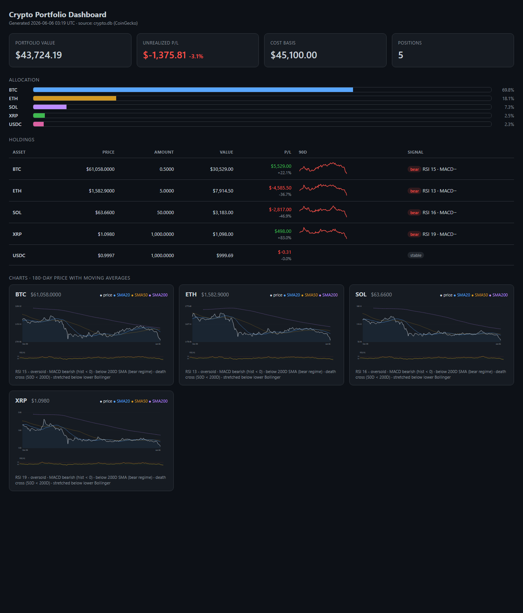

<div align="center">

```
██████╗  ██████╗ ███╗   ███╗██████╗ ██╗  ██╗██╗
██╔══██╗██╔═══██╗████╗ ████║██╔══██╗██║  ██║██║
██║  ██║██║   ██║██╔████╔██║██║  ██║███████║██║
██║  ██║██║   ██║██║╚██╔╝██║██║  ██║██╔══██║██║
██████╔╝╚██████╔╝██║ ╚═╝ ██║██████╔╝██║  ██║██║
╚═════╝  ╚═════╝ ╚═╝     ╚═╝╚═════╝ ╚═╝  ╚═╝╚═╝

          C R Y P T O   ·   T E R M I N A L
```

# ⚡ domdhi.crypto

**Your bags. Your terminal. Your data. No middlemen, no dashboards-as-a-service, no telemetry.**

A self-hosted crypto portfolio + technical-analysis engine that pulls straight from CoinGecko,
hoards it in local SQLite, runs the indicators by hand, and spits out a slick offline HTML dashboard.


</div>

<div align="center">
  
  <br><sub><i>The offline, single-file HTML dashboard — example data shown.</i></sub>
</div>

---

```
> the chart doesn't care about your feelings. neither does this.
```

## 🪙 What it does

- **Pulls** live prices + 365 days of history for any CoinGecko-listed coin — yes, including the weird alts (`hyperliquid`, anything with an id).
- **Hoards** it all in a local `crypto.db` (SQLite). Idempotent — re-run forever, no dupes, back-fills gaps.
- **Computes** the real indicators in pure `pandas`/`numpy`. No `pandas-ta`, no black boxes — RSI, MACD, SMAs, Bollinger, ATR, volatility, all hand-rolled and auditable.
- **Renders** a dark, offline, single-file HTML dashboard with inline SVG charts. No server. No CDN. No JS framework. Double-click and go.
- **Stays yours** — your API key and your exact holdings never leave your machine and are *git-ignored by default*.

---

## 🔑 Get a CoinGecko API key (free, ~2 min)

You need a key. The free **Demo** tier is plenty (≈30 calls/min, 10k calls/month).

1. Go to **<https://www.coingecko.com/en/api>** → click **"Get Your API Key Now"** (or hit the **Developer Dashboard**).
2. Create a free account / log in.
3. In the dashboard, hit **`+ Add New Key`** to mint a **Demo** API key.
4. Copy it — it looks like `CG-xxxxxxxxxxxxxxxxxxxxxxxx`.

> Got a paid **Pro/Analyst** key instead? Same deal — just set `"tier": "pro"` in your config (it switches the API host for you).

---

## 🧪 Quickstart

```bash
# clone it
git clone https://github.com/Domdhi/Domdhi.Crypto domdhi.crypto && cd domdhi.crypto

# install it (gives you the `domdhi-crypto` command + pulls deps)
pip install -e .          # or: uv pip install -e .

# 1. drop in your key  →  edit config.local.json, paste api_key, set tier
cp config.example.json config.local.json

# 2. set your bags     →  edit coins.local.json with your real holdings + cost basis
cp coins.example.json coins.local.json

# 3. light it up
domdhi-crypto init                 # forge the database
domdhi-crypto ingest               # pull 365d history + live snapshot
domdhi-crypto dashboard --open     # build the HTML dashboard + open it
```

That's it. You're off the grid.

> **Where your files live.** The CLI reads/writes `config.local.json`, `coins.local.json`,
> `crypto.db`, and `dashboard.html` in the **current directory** (run it from the
> repo, or set `$DOMDHI_CRYPTO_HOME` to point elsewhere). Prefer not to install?
> `python -m domdhi_crypto <command>` works too once deps are present.

---

## 🕹️ Commands

| Command | What it does |
|---|---|
| `domdhi-crypto init` | Create the SQLite database |
| `domdhi-crypto ingest` | Pull history + live snapshot for every coin in `coins.local.json` |
| `domdhi-crypto ingest --days 180` | Shorter pull (also: use `--days 30` for finer-grained OHLC/ATR) |
| `domdhi-crypto ta BTC` | Full indicator readout + signals for one coin (symbol or id) |
| `domdhi-crypto report` | Live value + P/L + signals across the whole portfolio |
| `domdhi-crypto dashboard` | Rebuild `dashboard.html` |
| `domdhi-crypto dashboard --open` | Rebuild + fling it into your browser |
| `domdhi-crypto factors BTC` | Rank the built-in factors by IC/ICIR for one coin |
| `domdhi-crypto backtest BTC` | Look-ahead-safe backtest of a factor rule |
| `domdhi-crypto mcp` | Run the MCP server for an LLM agent (needs the `[mcp]` extra: `pip install domdhi-crypto[mcp]`) |

**Daily ritual:**
```bash
domdhi-crypto ingest && domdhi-crypto dashboard --open
```

---

## ⚙️ Configure your bags — `coins.local.json`

```json
{
  "vs_currency": "usd",
  "coins": [
    { "id": "bitcoin",  "symbol": "BTC",  "amount": 0.5, "avg_entry": 50000 },
    { "id": "usd-coin", "symbol": "USDC", "amount": 1000, "avg_entry": 1.00, "stable": true }
  ]
}
```

- `id` — the **CoinGecko coin id** (not the ticker). Find it on the coin's CoinGecko page URL, or via `/coins/list`.
- `amount` / `avg_entry` — your holdings and blended cost basis (drives P/L).
- `"stable": true` — flags a stablecoin so it's skipped for TA.

---

## 📊 Indicators (`src/domdhi_crypto/signals/ta.py`)

RSI(14, Wilder) · MACD(12/26/9) · SMA 20/50/200 · EMA · Bollinger(20, 2σ) + %B · ATR(14) · annualized volatility (×√365 for 24/7 markets).

**Signals:** overbought/oversold · MACD sign · 200D bull/bear regime · golden/death cross · Bollinger stretch.

## 🗄️ What's in the DB

| Table | Contents |
|---|---|
| `coins` | id / symbol / name |
| `prices` | daily close + volume + market cap (from `/market_chart`) |
| `ohlc` | candles from `/ohlc` (see granularity note) |
| `snapshots` | timestamped live price + 24h/7d/30d change — append-only, so you build a history of every check-in |

---

## 🔒 Privacy & security

This is the whole point. **Nothing personal is ever tracked by git:**

| File | Holds | Status |
|---|---|---|
| `config.local.json` | your API key | 🚫 git-ignored |
| `coins.local.json` | your holdings + cost basis | 🚫 git-ignored |
| `crypto.db` | your price/portfolio data | 🚫 git-ignored |
| `dashboard.html` | your rendered numbers | 🚫 git-ignored |

The repo ships only `*.example.json` templates. Clone it, fill in your own, and your stack stays a secret. Rotate your key anytime — it's only in `config.local.json`.

---

## 🧱 Project layout

Two import packages ship in one distribution (`pip install domdhi-crypto`):

```
src/
├── domdhi_crypto/                  # engine — Vertical-Slice sub-packages
│   ├── cli.py                      # entry point + composition root (wires every slice)
│   ├── shared/      db.py, paths.py            core infra — SQLite + path resolution
│   ├── ingest/      coingecko.py               CoinGecko → SQLite acquisition
│   ├── signals/     ta.py, factors.py,         TA primitives, declarative factor
│   │                effectiveness.py           substrate + safe evaluator, IC/ICIR
│   ├── portfolio/   ledger.py, risk.py         NAV/avg-cost P&L, correlation/vol/beta/drawdown
│   ├── agent/       context.py                 agent-interface seam
│   ├── backtest/    engine.py, data_provider,  look-ahead-safe engine + arena
│   │                virtual_account,
│   │                execution_simulator,
│   │                attribution, arena.py
│   └── report/      digest.py                  offline Markdown digest
│       └── dashboard/                          offline HTML dashboard (package)
│           __init__.py · theme.py · charts.py · panels.py · scaffold.py · vendor/
└── domdhi_crypto_mcp/              # agent layer — one-way dependency on engine
    server.py                       # FastMCP stdio server
    decision.py                     # FR-23 decision schema + validation
                                    # (needs `pip install domdhi-crypto[mcp]`)
tests/           # pytest: ta, db, coingecko (no network)
.github/         # CI workflow + issue/PR templates
```

## 🛠️ Develop

```bash
uv venv && uv pip install -e . pytest ruff pre-commit   # or plain pip
pre-commit install
ruff check .     # lint
pytest           # tests (indicator math cross-checked vs textbook references)
```

CI runs ruff + pytest on Python 3.11–3.13. See [CONTRIBUTING.md](CONTRIBUTING.md)
for the design constraints (local-first, no `pandas-ta`, secrets stay git-ignored).

## ⚠️ Known limits

- **CoinGecko OHLC granularity is coarse for long ranges:** 1–2d → 30min, 3–30d → 4h, **31d+ → 4-day candles**. So daily RSI/MACD/SMA/Bollinger come from `/market_chart` (true daily); the `ohlc` table / ATR are 4-day candles on a 365d pull. Want daily ATR? `ingest --days 30`.
- **Demo tier:** ≈30 calls/min, history capped at 365 days. The client paces calls (2s) and backs off on 429s automatically.

---

## 💀 Disclaimer

This is a **personal tooling project**, not investment advice. The signals are mechanical readouts of math, not a crystal ball. Do your own research. It's your money and your face. Not a licensed anything.

<div align="center">

```
stay liquid. trust the math. touch grass occasionally.
```

</div>
